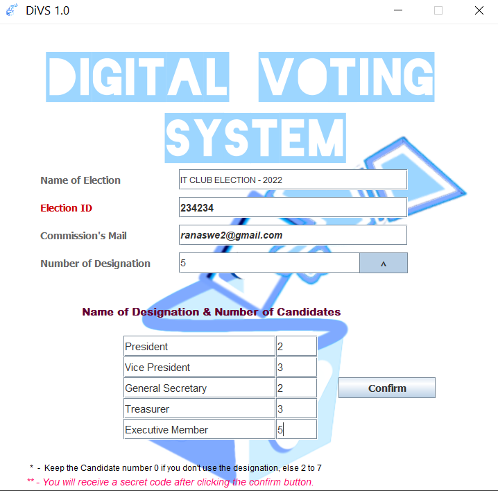
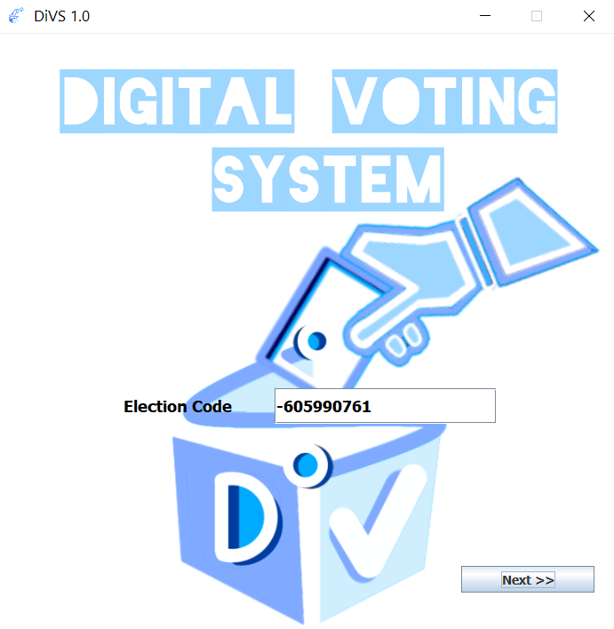

# Digital Voting System
Digital Voting System (DiVS) refers to procedures that make use of digital technologies, particularly the internet, to permit someone to vote in an election and to have their votes counted online. DiVS enables your voters to participate in elections if they are in a vote booth. The election commissioner appoint one or more person as a polling officer (PO). Each PO receives a mail with **Election Code**, **PO ID** and **Booth Number** to active vote booth. As long as they have a PC with Windows OS (for given DiVS-Setup.exe) and the DiVS software, they can cast their vote within **valid voting time**. Sharing above three codes, enables your voters to participate in elections wherever they are in the world. Permitting your electorate the opportunity to vote online increases your voter turnout. Moreover, voting with DiVS gives you peace of mind - our software is approved under the most heightened security standards.


## Title
```
Project Title : Digital Voting System (DiVS)
```
## Installation Process

### Step 0

 the Application

### Step 1


### Step 2


### Step 3


### Step 4


### Step 5


### Step 6


### Step 7


## Create Election

This application is useful for maximum 5 designation/post per election.


Enter candidate number from 2 to 7 for each post.


## EC Login


## Vote Booth


## Election Result



```
Thanks to visit this DiVS repository...
```
